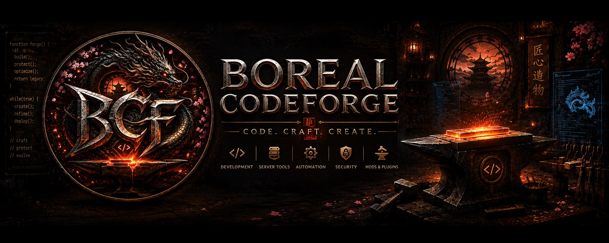

# Boreal Codeforge Docs

Code. Craft. Create.

Willkommen in der offiziellen Dokumentation der **Boreal Codeforge**-FiveM-Resourcen.
Premium-Scripts mit Fokus auf Performance für ESX & QBCore — vollständig
zweisprachig (EN/DE), Escrow-ready und aufeinander abgestimmt.

## Hier starten

- [**Erste Schritte**](getting-started.md) — Voraussetzungen, Installation, Sprache, Updates
- [**Boreal Core**](boreal-core.md) — das Admin-Dashboard & Framework, das alles verbindet
- [**Payphone Robbery**](boreal-payphone-robbery.md) — das erste von mehreren Raub-Scripten

## Brauchst du Hilfe?

Eröffne ein Ticket in unserem [Discord](https://discord.com/invite/QA7nnEF2Wr) und gib an: Framework (ESX/QBCore),
Server-Artifact-Version, die Konsolen-Fehlermeldung und die relevanten
`config.lua`-Werte.

!!! tip "Zwei Sprachen"
    Jede Seite gibt es auf Deutsch und Englisch — oben rechts über den
    Sprachumschalter wechseln.
